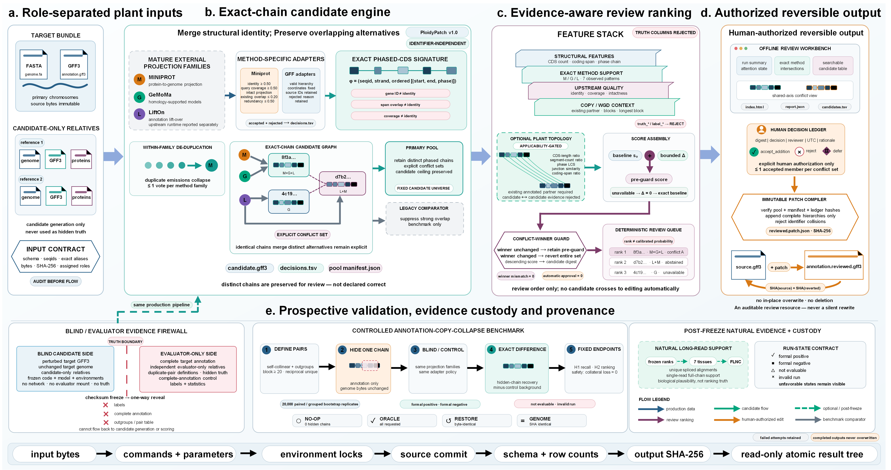
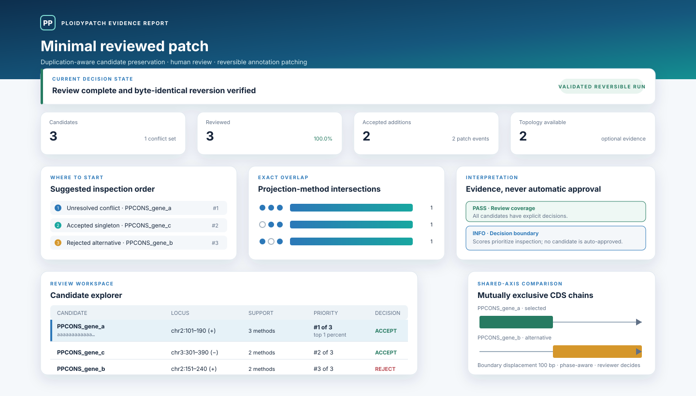

<h1 align="center">PloidyPatch</h1>

<p align="center"><strong>Duplication-aware, review-first plant gene-model repair</strong></p>

<p align="center">
  <a href="https://github.com/707728642li/PloidyPatch/actions/workflows/test.yml"></a>
  <a href="https://github.com/707728642li/PloidyPatch/releases/tag/v1.0"></a>
  <a href="https://pypi.org/project/ploidypatch/"></a>
  <a href="https://anaconda.org/bioconda/ploidypatch"></a>
  <a href="https://zenodo.org/records/21875561"></a>
  <a href="LICENSE"></a>
  
  <a href="CITATION.cff"></a>
</p>

PloidyPatch is a plant-specific, duplication-aware toolkit for preserving and
reviewing gene structures that conventional annotation transfer workflows can
suppress in duplicated genomes. It integrates candidate models from mature
projection tools, preserves distinct phased CDS chains, adds copy-aware
evidence when applicable, and compiles explicit reviewer decisions into
immutable, reversible GFF3 patches.

> **Design boundary:** PloidyPatch is a repair and consistency layer, not a
> replacement gene predictor. It never infers gene absence from a missing GFF
> feature, never silently approves a candidate, and never modifies the source
> annotation in place.

<p align="center">
  
</p>

## Why PloidyPatch?

Plant gene annotation is unusually sensitive to whole-genome duplication,
fractionation, tandem duplication, and homeologous sequence similarity.
Projection pipelines can therefore produce multiple biologically meaningful
structures at one locus—or suppress one valid copy as an apparent overlap.
PloidyPatch makes that uncertainty explicit and reviewable.

| Capability | What it provides |
|---|---|
| Chain-preserving consensus | Retains structurally distinct CDS chains instead of collapsing by span alone |
| Plant duplication context | Adds copy, synteny, and optional WGD-topology evidence without making it universally mandatory |
| Multi-tool provenance | Tracks support from Miniprot, GeMoMa, LiftOn, and normalized external models |
| Human-in-the-loop decisions | Requires an explicit `accept_addition` review decision; `automatic_approval=false` |
| Reversible annotation repair | Applies a content-bound patch and verifies byte-identical source recovery |
| Reproducible evaluation | Uses checksums, immutable manifests, hidden-truth custody, and formal positive/negative/not-evaluable states |

## Installation

### Pip / PyPI

```bash
python -m pip install ploidypatch==1.0.0
```

### Conda / Bioconda

PloidyPatch 1.0.0 is available from the
[Bioconda channel](https://anaconda.org/bioconda/ploidypatch) as a
platform-independent `noarch` Python package. We recommend a dedicated
environment:

```bash
mamba create -n ploidypatch \
  -c conda-forge -c bioconda \
  --strict-channel-priority \
  ploidypatch=1.0.0
conda activate ploidypatch
ploidypatch --version
```

`conda` can be used in place of `mamba`. To install into an existing
compatible environment:

```bash
conda install -c conda-forge -c bioconda \
  --strict-channel-priority \
  ploidypatch=1.0.0
```

The channel package is built from the immutable v1.0 release and is tested on
Python 3.11 or later. Research-evaluation and visualization features remain
optional; see the [installation guide](docs/INSTALLATION.md) for their
dependency groups and for separately managed projection and synteny programs.

For checksum-bound archival reproduction, the GitHub release also provides the
same core as a standalone Conda artifact:

```bash
conda create -n ploidypatch python=3.11
conda install -n ploidypatch \
  https://github.com/707728642li/PloidyPatch/releases/download/v1.0/ploidypatch-1.0.0-py_0.conda
```

Alternatively, install the tagged source in an isolated environment:

```bash
conda create -n ploidypatch -c conda-forge python=3.11 pip
conda activate ploidypatch
python -m pip install \
  "ploidypatch @ git+https://github.com/707728642li/PloidyPatch.git@v1.0"
ploidypatch --version
```

### From a source checkout

```bash
git clone https://github.com/707728642li/PloidyPatch.git
cd PloidyPatch
conda create -p envs/ploidypatch -c conda-forge python=3.11 -y
conda run -p envs/ploidypatch --no-capture-output python -m pip install .
conda run -p envs/ploidypatch --no-capture-output ploidypatch --version
```

For development and the reproducible public test suite:

```bash
conda run -p envs/ploidypatch --no-capture-output \
  python -m pip install -e ".[test]"
conda run -p envs/ploidypatch --no-capture-output \
  python scripts/run_public_test_suite_v1.py
```

The dependency-light core does not silently install external gene predictors,
aligners, or synteny programs. Miniprot, GeMoMa, LiftOn, DIAMOND, WGDI,
SynGAP, and long-read preprocessing tools belong to separately pinned workflow
environments; see the [installation guide](docs/INSTALLATION.md).

### Platform support

Production annotation and validation workflows are supported on **Linux**.
The portable review/patch core is also tested through the Bioconda macOS build,
but availability of the external bioinformatics programs varies by platform.
Native Windows is not an officially supported bioinformatics platform and no
Windows-specific PloidyPatch package is published. Windows users should run the
Linux workflow through WSL2, a Linux server, or the documented container.

## Five-minute verified tutorial

The bundled example is a complete, checksum-bound miniature dataset. It
contains a source GFF3, three candidate models, one mutually exclusive conflict,
an immutable candidate-pool manifest, and an explicit review ledger.

```bash
python examples/minimal_reviewed_patch/run_example.py \
  --output-dir work/minimal_reviewed_patch
```

The runner performs five public CLI operations:

1. compile only explicitly accepted candidates;
2. create a source-bound patch;
3. apply it to a new annotation; and
4. revert it and require byte-identical recovery of the input GFF3; and
5. generate a checksum-bound interactive report with no network dependency.

Successful output includes `run_summary.json`, `command_log.jsonl`, the applied
and reverted annotations, `report/index.html`, and `SHA256SUMS`. The expected result contains two
accepted additions, no automatic approval, and identical source/reverted
SHA-256 values. Continue with the [step-by-step tutorial](docs/TUTORIAL.md) or
inspect the [example data dictionary](examples/minimal_reviewed_patch/README.md).

### Interactive result-report preview

Open the tracked [validated example report](docs/examples/report_preview/index.html)
to inspect ranked triage queues, exact method intersections, shared-axis
conflict structures, topology explanations, editable review-ledger workflow,
and complete checksum provenance. The HTML is a self-contained demonstration
generated from the same eight checksum-bound files shipped in the package.

<p align="center">
  
</p>

The preview is the complete offline workbench, not a static dashboard mock-up:
search, filters, keyboard selection, conflict-set comparison, machine-readable
exports, and a review-ledger template are all generated together and bound by
`SHA256SUMS`.

## Command-line interface

```text
ploidypatch
├── audit       validate an annotation bundle and its identifiers
├── baseline    adapt and summarize external projection baselines
├── benchmark   generate and evaluate controlled annotation perturbations
├── evidence    construct copy, synteny, topology, and review evidence
├── graph       combine explicit evidence into auditable decisions
├── normalize   normalize provider-specific GFF3/FASTA bundles
├── patch       compile, create, apply, and revert annotation patches
└── report      build an offline interactive review report
```

There are 87 executable leaf commands in the current source tree. Use built-in help at every
level:

```bash
ploidypatch --help
ploidypatch patch --help
ploidypatch patch compile-reviewed-copy-additions --help
```

The [CLI reference](docs/CLI_REFERENCE.md) explains every command family,
input schemas, outputs, and failure behavior. The generated
[complete parameter reference](docs/CLI_PARAMETERS.md) lists every required and
optional argument, type, default, and choice. The exact parser-derived inventory is also available as
[`CLI_COMMAND_INVENTORY_v0.1.json`](docs/CLI_COMMAND_INVENTORY_v0.1.json).

## Typical reviewed-patch workflow

```bash
# 1. Compile explicit review decisions into addition events.
ploidypatch patch compile-reviewed-copy-additions \
  --annotation-gff source.gff3 \
  --candidate-gff candidate.gff3 \
  --pool-decisions decisions.tsv \
  --pool-manifest candidate.gff3.manifest.json \
  --review-decisions review_decisions.tsv \
  --output-edits-json reviewed.edits.json

# 2. Bind those edits to the exact source annotation.
ploidypatch patch create \
  --source-gff source.gff3 \
  --edits-json reviewed.edits.json \
  --output-patch reviewed.patch.json

# 3. Write a new annotation; the source is not overwritten.
ploidypatch patch apply \
  --source-gff source.gff3 \
  --patch reviewed.patch.json \
  --output-gff annotation.reviewed.gff3

# 4. Prove reversibility.
ploidypatch patch revert \
  --patched-gff annotation.reviewed.gff3 \
  --patch reviewed.patch.json \
  --output-gff annotation.reverted.gff3
```

See the [user guide](docs/USER_GUIDE.md) for preparing manifests, recording
review decisions, interpreting abstention, and auditing identifiers.

## Evidence snapshot

The manuscript evidence is frozen; revealed systems are not retuned.

- In prospective *Populus trichocarpa* confirmation, the chain-preserving pool
  recovered 731/800 exact phased CDS chains versus 663/800 after legacy
  overlap suppression (paired delta 0.0850; 95% interval 0.06625–0.1050).
- In prospectively frozen *Actinidia chinensis*, the structural endpoint
  improved from 333/800 to 406/800. The composite result remains formally
  negative because topology covered 62.07% of positive candidates, below the
  preregistered 70% gate.
- In untouched allotetraploid *Coffea arabica*, recovery improved from 597/800
  to 672/800, with zero collateral transcript loss in all six arms.
- A Golden Delicious apple audit found 433 strict multi-exon candidates with
  full-length long-read support.
- The largest scaling run processed 76,434 candidates and 16,011 conflicts in
  70.48 seconds with 1.16 GiB peak resident memory.
- A cross-species experimental ranker was retired after failing transfer gates;
  duplication topology remains optional, applicability-gated evidence.

The [research status](docs/RESEARCH_STATUS_2026-08-10.md), frozen protocols,
and checksum-bound examples preserve the complete claim boundary.

## Documentation

| Document | Audience |
|---|---|
| [Installation](docs/INSTALLATION.md) | Core, optional evaluation, containers, and workflow dependencies |
| [Tutorial](docs/TUTORIAL.md) | New users following the verified example step by step |
| [User guide](docs/USER_GUIDE.md) | Real-data workflow, review ledger, and failure handling |
| [Result report](docs/RESULT_REPORT.md) | Interactive summary, candidate explorer, and interpretation guide |
| [Public versioning](docs/VERSIONING_AND_PAPER_RELEASE_v1.0.md) | Public v1.0 identity and immutable internal-snapshot provenance |
| [v1.0 readiness](docs/RELEASE_READINESS_v1.0.md) | Engineering gates, verification results, and publication boundary |
| [CLI reference](docs/CLI_REFERENCE.md) | Commands, parameters, schemas, and outputs |
| [Testing guide](docs/TESTING.md) | Public CI suite, fixture checks, and archival-test boundary |
| [Reproducibility guide](docs/REPRODUCIBILITY_GUIDE.md) | Checksums, manifests, frozen protocols, and truth isolation |
| [Container guide](docs/CONTAINER_GUIDE.md) | Digest-pinned non-root execution |
| [Contributing](CONTRIBUTING.md) | Development setup and pull-request rules |
| [Support](SUPPORT.md) | Bug reports, questions, and private contact |

## Reproducibility and testing

- CI tests Python 3.11, 3.12, and 3.13.
- The public runner executes every test supported by a clean clone; six named
  manuscript-archive audits remain available to maintainers with the frozen
  upstream result tree.
- Wheel and source distributions are built independently twice and must be
  byte-identical.
- Both distributions are installed into clean environments and run through the
  verified example without source-tree imports.
- The core container runs as `10001:10001`, read-only and without network
  access during the example.
- Scientific holdouts distinguish `formal_positive`, `formal_negative`,
  `not_evaluable`, and `invalid_run`; failures are retained rather than tuned
  away.

## Citation

Use GitHub's **Cite this repository** panel or [`CITATION.cff`](CITATION.cff).
The archived v1.0 software release is available from the stable Zenodo
[record 21875561](https://zenodo.org/records/21875561), with version DOI
`10.5281/zenodo.21875561`. Zenodo retains the all-version concept DOI in the
record metadata. The associated manuscript citation will be added after
publication without changing the immutable software-release identity.

## License and contact

PloidyPatch is released under the [BSD 3-Clause License](LICENSE).

- Maintainer: **Taishan Li**, Chinese Academy of Forestry
- Work email: [litaishan@caf.ac.cn](mailto:litaishan@caf.ac.cn)
- Bugs and feature requests: [GitHub Issues](https://github.com/707728642li/PloidyPatch/issues)

Please do not send confidential genomes, credentials, or unpublished sample
metadata through public issues.
